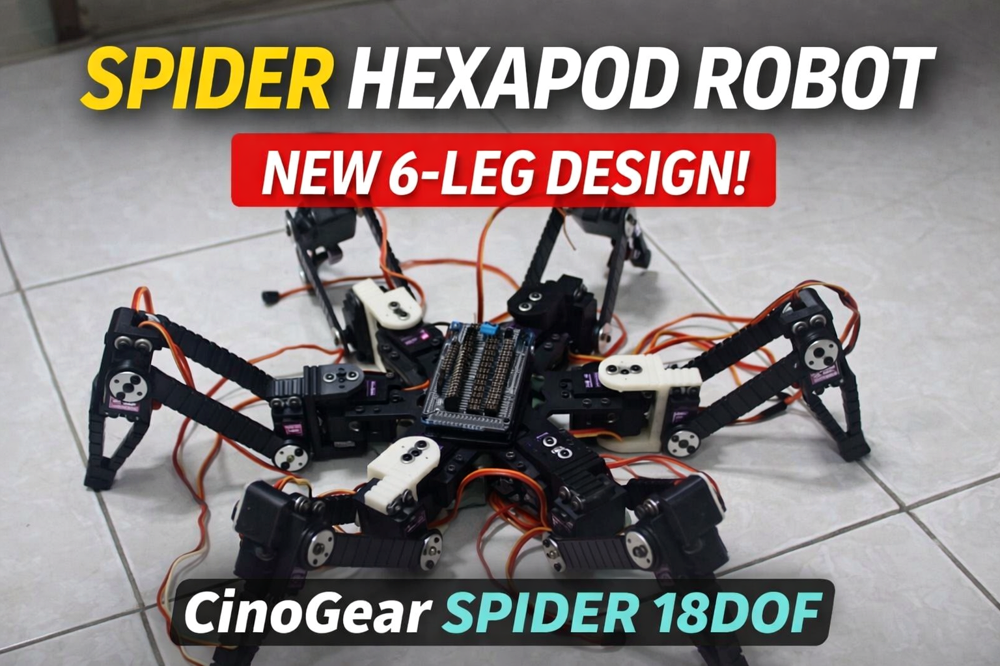
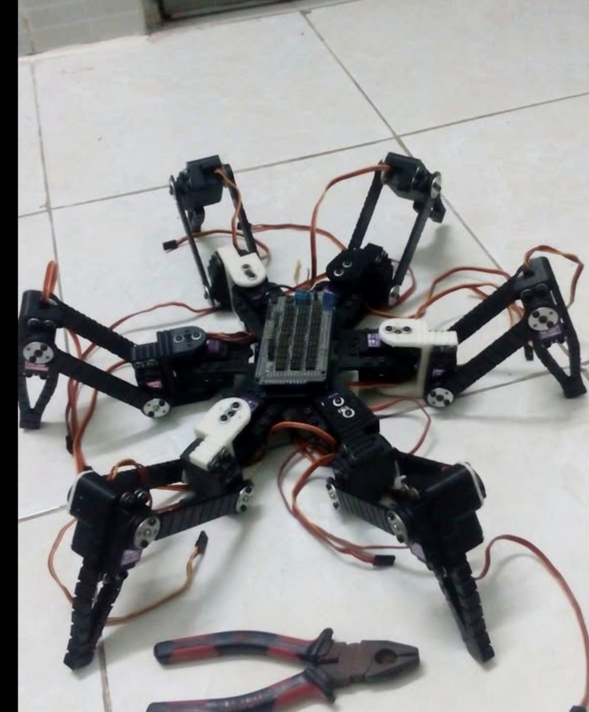
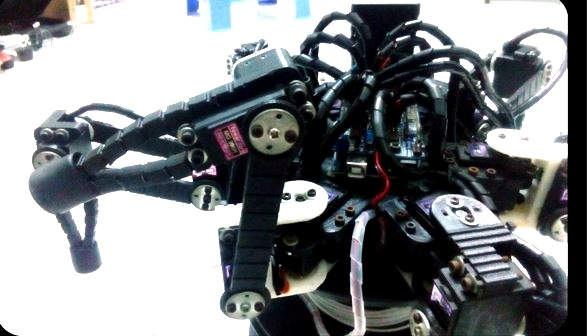

# CinoGear Spider 18DOF

A practical 18DOF spider-style hexapod robot platform under the **CinoGear** brand.

## Product Focus

CinoGear Spider 18DOF is the first public robot product in the CinoGear lineup. This repository is designed as a clean public-facing workspace for firmware, technical documentation, BOM assets, and marketplace-ready project support files.

## Highlights

- 18DOF spider-style hexapod platform
- 6-leg mechanical layout
- SSC-32 control workflow reference
- BotBoarduino / PS2-style controller structure
- Public BOM and build notes
- Marketplace-ready documentation structure for Gumroad and MyMiniFactory

## Preview Gallery

### Full Robot Build

### Head / Front Detail

## Repository Structure

- `firmware/` main controller source, supporting firmware files, and controller library references
- `docs/` public documentation, configuration notes, and legal/reference material
- `bom/` bill of materials and sourcing support files
- `media/` cover images, previews, and presentation visuals
- `marketplace/` public-facing marketplace support text for product listings

## Included Public Components

### Firmware
- `firmware/BotBoarduino_CH3R_PS2/`
- `firmware/PS2X_Library/PS2X_lib/`

### Documentation
- `docs/overview/`
- `docs/legal/`

### BOM
- `bom/CinoGear_Spider18DOF_BOMList.xlsx`

## Project Positioning

This repository is intended to look professional on GitHub while staying clean enough to support later commercial packaging. Public-facing files live here. Private design iterations, unreleased assets, and any reference-only material should stay outside this repo until they are ready and safe to publish.

## Commercial Packaging

The full CinoGear product workflow may include:
- a public GitHub repository for technical trust
- Gumroad bundles for documentation and packaged downloads
- MyMiniFactory product pages for printable assets when commercially cleared

## Legal and Attribution Notes

This repository includes public-facing project structure under the **CinoGear** brand while keeping third-party notices and attribution visible.

Before redistributing or repackaging any included third-party components, review:
- `LICENSE_MATRIX.md`
- `THIRD_PARTY_NOTICES.md`
- `CREDITS_AND_ACKNOWLEDGMENTS.md`
- `docs/legal/THIRD_PARTY_REFERENCES.md`

## Roadmap Direction

Short-term goals:
- improve GitHub presentation quality
- add more preview media
- refine public documentation
- prepare a cleaner marketplace bundle structure

Long-term goals:
- expand CinoGear into a multi-product robotics brand
- separate firmware, docs, STL, and commercial bundles cleanly
- publish more polished product pages and release assets

## Brand

**CinoGear**  
Practical robotics builds, firmware packaging, and commercial-ready technical documentation.